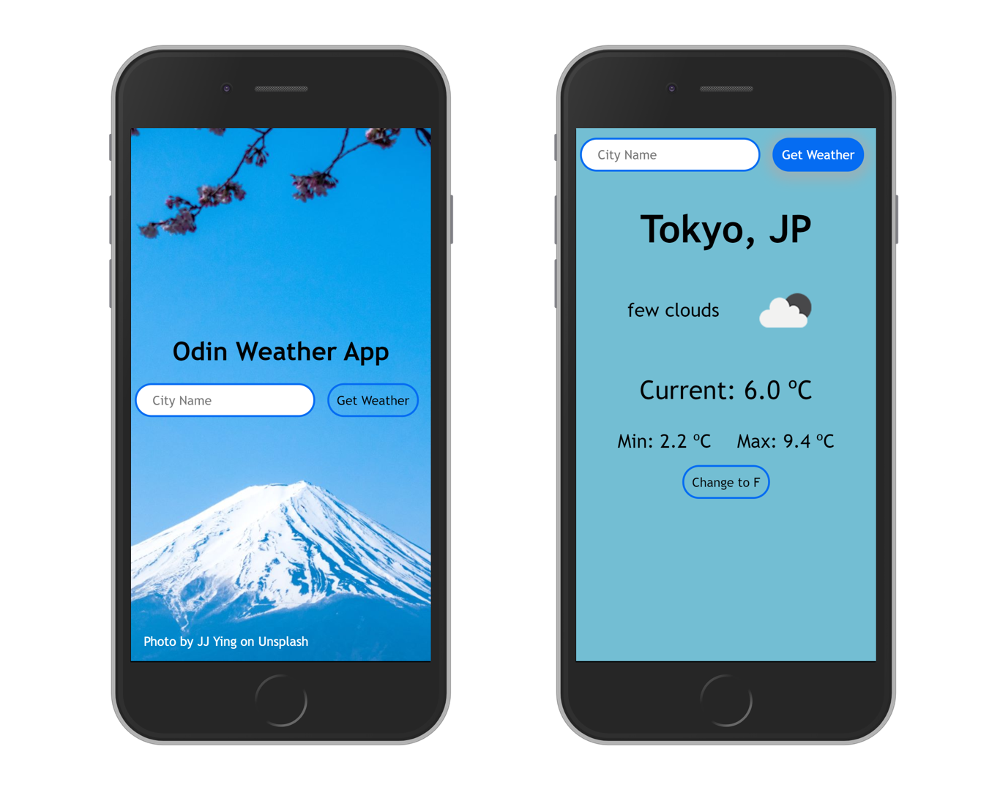

# Odin Weather App

> A project to practice JavaScript asynchronous communication

This is vanilla JavaScript implementation of the app, please switch to [`react-dev`](https://github.com/juzQrios/odin-weather-app/tree/react-dev) branch for React implementation.

[//]: # (Screenshot, Application concept art etc)


[//]: # (Live Demo link)
<p align="center">
  <a href="https://raw.githack.com/juzQrios/odin-weather-app/master/dist/index.html">Live Demo</a>
</p>

## Built With

* HTML
* CSS
* JavaScript

## Get Started

### Setup

1. Clone this repository.

```bash
git clone git@github.com:juzQrios/odin-weather-app.git
```

2. Install dependencies.

```bash
npm install
```

3. Build source code.

```bash
npm run build-dev
```

4. Open `./dist/index.html` in a browser.

### Tests

While it is a good practice to test code, this project doesn't have any tests right now but I might add them in future.

### Deployment

You need to deploy `./dist` after building the source code.

## Contributing

Contributions, issues and feature requests are welcome!

Feel free to checkout this project's [Kanban board](https://github.com/juzQrios/odin-weather-app/projects/1) or [issues page](https://github.com/juzQrios/odin-weather-app/issues).

## Acknowledgments

* [OpenWeather API](http://openweathermap.org/)

## License

This project is [MIT](./LICENSE) licensed.

## Authors

#### Darshan

* Github: [@juzQrios](https://github.com/juzQrios)
* Linkedin: [Darshan J](https://www.linkedin.com/in/jayadevdarshan/)
* Email: <jayadev.darshan@gmail.com>
