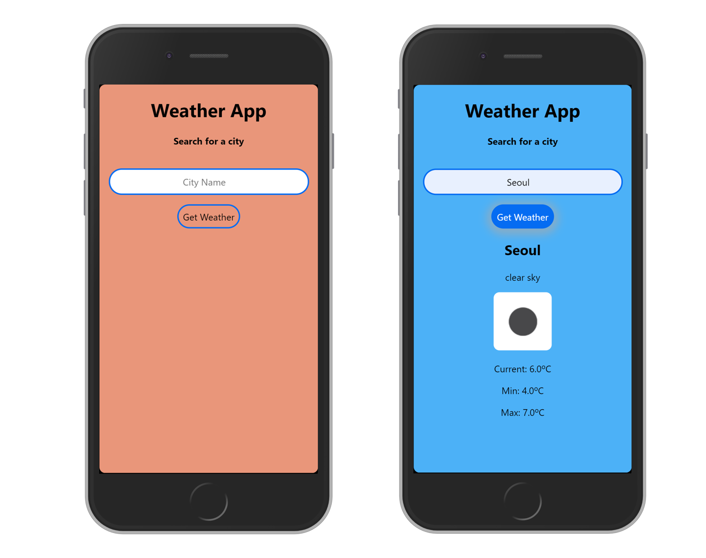

# Odin Weather App

> A project to practice JavaScript asynchronous communication

This is React implementation of the app, please switch to [`development`](https://github.com/juzQrios/odin-weather-app/tree/development) branch for Vanilla JavaScript implementation.

[//]: # (Screenshot, Application concept art etc)


[//]: # (Live Demo link)
<p align="center">
  <a href="https://odin-weather-app.netlify.com/">Live Demo</a>
</p>

## Built With

* HTML
* CSS
* React

## Get Started

### Setup

1. Clone this repository.

```bash
git clone git@github.com:juzQrios/odin-weather-app.git
```

2. Switch to `react-dev` branch.

```bash
git checkout react-dev
```

3. Install dependencies.

```bash
yarn install
```

4. Start the local server.

```bash
yarn start
```

5. Open `http://localhost:3000/ ` in a browser.

### Tests

While it is a good practice to test code, this project doesn't have any tests right now but I might add them in future.

### Deployment

You can easily deploy this React application using one of the several methods to [Netlify](https://www.netlify.com).

Easiest method being to deploy it from Git by clicking on the "[New site from Git](https://app.netlify.com/start)" button on Netlify dashboard.


## Contributing

Contributions, issues and feature requests are welcome!

Feel free to checkout this project's [Kanban board](https://github.com/juzQrios/odin-weather-app/projects/1) or [issues page](https://github.com/juzQrios/odin-weather-app/issues).

## Acknowledgments

* [OpenWeather API](http://openweathermap.org/)
* [create-react-app](https://github.com/facebook/create-react-app)

## License

This project is [MIT](./LICENSE) licensed.

## Authors

#### Darshan

* Github: [@juzQrios](https://github.com/juzQrios)
* Linkedin: [Darshan J](https://www.linkedin.com/in/jayadevdarshan/)
* Email: <jayadev.darshan@gmail.com>
